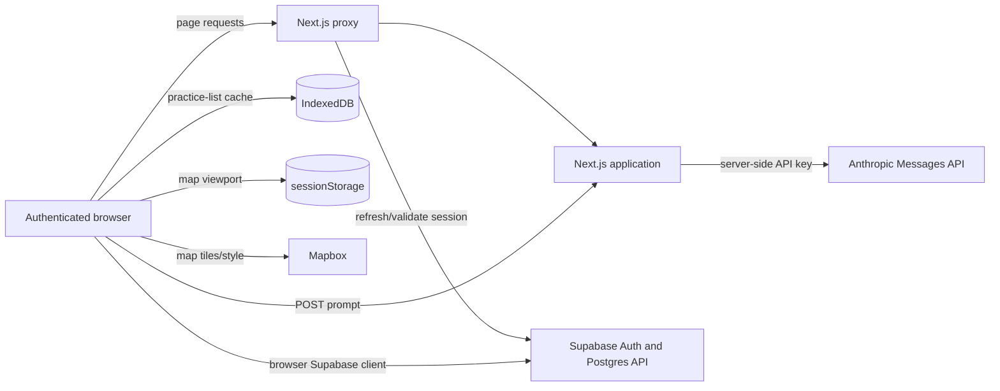
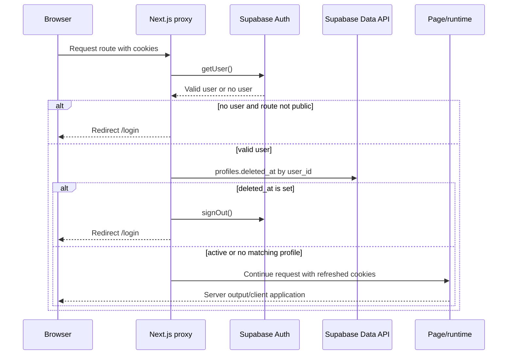

# Application architecture

## Status and evidence

This document describes the repository as inspected on 2026-07-19. A statement labeled **Code-derived fact** is supported by application code, package metadata, or a tracked migration. A statement labeled **Owner confirmation required** is not established by this repository and must not be treated as an operational or contractual fact.

Primary evidence: `package.json`, `src/app/**`, `src/components/**`, `src/lib/**`, `src/proxy.ts`, and `supabase/migrations/**`. The repository contains no deployment manifest, infrastructure definition, observability configuration, ingestion implementation, or production schema baseline.

## System context

**Code-derived facts**

- Atlas is a Next.js 16.2.9 App Router application using React 19.2.4 and TypeScript.
- Supabase provides authentication and the Postgres-facing data API. Both browser and server clients use `NEXT_PUBLIC_SUPABASE_URL` and `NEXT_PUBLIC_SUPABASE_PUBLISHABLE_KEY`.
- Mapbox GL JS renders the practice map in the browser using a browser-visible token.
- The server route `POST /api/generate-report` forwards a caller-supplied prompt to Anthropic using a server-only credential.
- The browser persists practice-list data in IndexedDB and map viewport state in `sessionStorage`.

**Owner confirmation required**

- Hosting provider, regions, DNS/CDN topology, environment separation, Supabase project layout, backups, and disaster-recovery design.
- Whether a WAF, rate limiter, network allowlist, centralized log sink, APM product, or alerting system exists outside this repository.
- Service ownership, availability objectives, traffic expectations, and scaling limits.

## Runtime boundaries

### Next.js server boundary

The root layout (`src/app/layout.tsx`) supplies metadata, fonts, global CSS, and the navigation wrapper. Most product pages are client components; notable server-rendered boundaries are the root page, legal and informational pages, the admin layout, and the admin report inbox loader.

`src/proxy.ts` runs for nearly all non-static paths. It constructs a Supabase SSR client, reads and writes auth cookies, calls `auth.getUser()`, redirects unauthenticated requests outside the public allowlist, and signs out accounts whose profile has a non-null `deleted_at`. This is route gating and session refresh; it is not a substitute for database authorization.

The server Supabase helper (`src/lib/supabase-server.ts`) reads request cookies and attempts to write refreshed cookies. The caught cookie-write exception accommodates contexts in which cookie mutation is unavailable.

### Browser boundary

`src/lib/supabase.ts` creates a browser client configured with `flowType: 'implicit'`. Client pages call the Supabase data API directly for profiles, practices, doctors, affiliations, shortlists, employer leads, and practice error reports. Consequently:

1. the publishable key is intentionally present in browser code;
2. every exposed table operation must be constrained by database grants and RLS;
3. hiding a control or redirecting in React is not authorization.

The authoritative RLS inventory is absent for all referenced tables except `practice_error_reports`. See `docs/data/domain-model-and-authorization.md`.

### External service boundary

- Mapbox runs in the practice-list client and receives map requests plus normal network metadata. The exact token restrictions and Mapbox account configuration are not in the repository.
- Anthropic is called only from the Next.js route handler. The API key remains server-side, but the route currently accepts arbitrary `prompt` text and does not independently authenticate or authorize the caller.
- Supabase receives authentication operations and direct browser data queries/mutations.
- Remote Unsplash images are referenced by URL on authentication screens.

## Major data flows

### Authenticated page request

The proxy only tests `deleted_at` when a profile is returned; absence of a profile does not block ordinary protected routes. Onboarding is handled after OAuth/email callbacks and after password recovery, not as a universal proxy rule.

### Product-data reads and writes

Client pages query Supabase directly:

- practice and physician lists/details read `practices`, `doctors`, and `affiliations`;
- favorites read and mutate `shortlists`, linked through a profile ID and practice ID;
- jobs read `employer_leads`;
- account/onboarding read, upsert, and update `profiles`;
- corrections insert `practice_error_reports`;
- admin screens read/update profiles, leads, and reports.

The admin layout performs a server-side `profiles.is_admin` check. Several admin client pages repeat the check. Actual protection for direct data requests still depends on RLS/grants.

### AI report generation

The report-builder client submits a prompt to `POST /api/generate-report`. The route validates only that it is a non-empty string, then sends it to Anthropic model `claude-sonnet-4-6` with a 1,000-token response limit. The route returns the upstream response and can return upstream error details.

No code in the route verifies a Supabase user, checks `is_admin`, limits body size, rate-limits requests, constrains prompt content, or records an audit event. Proxy gating currently makes the route unavailable to a caller without a valid application session under normal routing, but any authenticated user can reach it; proxy gating does not establish admin authorization.

## Browser caching

`src/lib/atlas-cache.ts` implements an in-memory and IndexedDB cache. Large arrays (more than 1,500 records) are split into chunks of 800. Practice-list cache constants are:

- database: `AtlasPracticesDB`;
- store: `practices`;
- key: `atlas_practices_v2`;
- TTL: one hour.

Fresh practice-detail data patches matching records in the practice-list cache. Favorites use a separate in-memory, user-keyed cache with a 30-minute default TTL; they are not persisted by that module. Practice map center, zoom, and last-view state use `sessionStorage`.

Cache expiry controls reuse, not deletion. IndexedDB records are not actively removed at TTL expiry and no logout cleanup is implemented in the cache modules. Cached practice rows include names, location, scores, roster size, coordinates, phone, and organization identifier; they do not include profile records in the observed implementation.

## Failure behavior

- Browser Supabase queries commonly render empty/loading states and do not expose structured retry or telemetry.
- IndexedDB failures degrade to network data and are logged to the browser console.
- Mapbox initialization depends on the browser token and runtime WebGL/network behavior.
- Anthropic failures are returned to the client as JSON; no retry, timeout, circuit breaker, or request correlation is implemented.
- The proxy depends on Supabase Auth for every matched protected request and also queries `profiles`.

**Owner confirmation required**

- Approved user-facing degradation modes, retry policy, timeout policy, error-reporting service, logging retention, and incident escalation.
- Whether upstream error bodies from Anthropic may be returned to application clients.

## Security model

The architecture has three layers:

1. proxy authentication and deleted-account gating;
2. server layout checks for the admin route family;
3. Supabase database authorization for direct browser operations.

Only layer 3 can reliably prevent a browser user from issuing a modified query. The tracked migration proves RLS only for `practice_error_reports`: authenticated users can insert a report associated with their own profile, while admins can select and update. No DELETE policy is defined there.

The browser key is publishable, not a secret. `ANTHROPIC_API_KEY` is server-only. Secret values must never be added to documentation, client code, logs, or screenshots.

## Current known limitations

- The production schema and RLS policies are not reproducible from this repository.
- No ingestion pipeline or refresh scheduler exists in the repository.
- No tests, CI workflow, deployment topology, or observability setup is present. The repository now contains code-derived operational runbook drafts, but their owner-dependent procedures are not yet approved.
- The AI route lacks route-local authentication, admin authorization, rate limiting, and payload-size controls.
- Public informational pages are mostly blocked by the proxy despite being static content; only Terms and Privacy are allowlisted.
- The browser auth client declares implicit flow while callback and recovery code also supports PKCE codes and token hashes, creating multiple compatibility paths.
- Soft deletion only sets `profiles.deleted_at`; hard deletion, restoration, cascading, and cache clearing are not implemented here.

## Owner confirmation required

Before this document can be authoritative, owners must provide:

- a production architecture diagram and environment/region inventory;
- authoritative schema, grants, and all RLS policies;
- ingestion system location and ownership;
- observability, SLO, capacity, backup, and recovery details;
- approved external processor configuration and data boundaries;
- rationale and remediation decisions for the AI endpoint and mixed auth flows.
