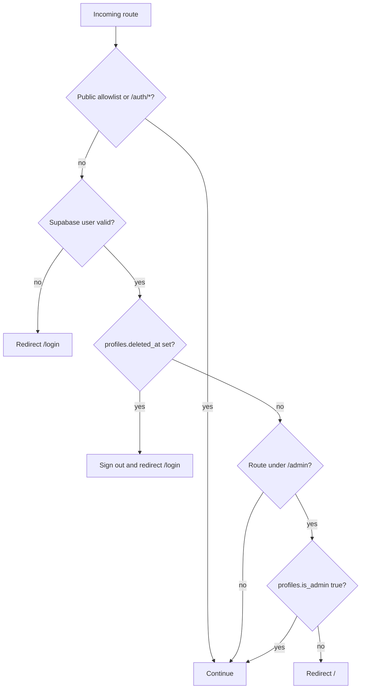

# Routes and access control

## Reading this document

This inventory is derived from `src/app/**`, `src/proxy.ts`, `src/app/admin/layout.tsx`, and the tracked `practice_error_reports` migrations as inspected on 2026-07-19.

- **Code-derived fact** means the behavior exists in this repository.
- **Owner confirmation required** means policy intent or external configuration is unknown.
- “Protected by proxy” means the route requires a valid Supabase user under the current Next.js routing path. It does not prove table-level authorization.
- “Admin layout” means the server layout also requires `profiles.is_admin = true`.

## Global request policy

`src/proxy.ts` matches all paths except Next.js static/image assets, the favicon, and common image extensions. Its public allowlist is:

- `/login`
- `/signup`
- `/forgot-password`
- `/terms-and-conditions`
- `/privacy-policy`
- every path beginning `/auth/`

All other matched routes redirect unauthenticated visitors to `/login`. For authenticated requests outside the public set, the proxy reads `profiles.deleted_at`; a non-null value causes sign-out and redirect to `/login`.

The proxy does not enforce onboarding completion, `is_admin`, per-record ownership, or operation-specific privileges. Supabase RLS/grants must authorize every browser-direct query.

## Page routes

| Route | Rendering boundary | Current audience and checks | Data/actions |
|---|---|---|---|
| `/login` | Client | Public allowlist | Password login; Google OAuth; implicit-fragment compatibility |
| `/signup` | Client | Public allowlist | Email/password signup; Google OAuth |
| `/forgot-password` | Client | Public allowlist | Sends recovery email |
| `/auth/callback` | Route handler | Public by `/auth/*` | Verifies invite/recovery token hash or exchanges auth code; redirects by recovery/onboarding state |
| `/auth/confirm` | Client | Public by `/auth/*` | Reads current session and redirects |
| `/auth/set-password` | Client | Public by `/auth/*`; requires recovery session in page logic | Exchanges code, verifies recovery token, or accepts legacy fragment; changes password |
| `/onboarding` | Client | Protected by proxy | Upserts/updates own expected profile and consent fields |
| `/terms-and-conditions` | Server/static component | Public allowlist | Legal copy |
| `/privacy-policy` | Server/static component | Public allowlist | Legal/privacy copy |
| `/` | Server shell plus client home | Protected by proxy | Server gets user; client reads profile and aggregate table counts |
| `/practices` | Client | Protected by proxy | Reads practices; reads/mutates shortlists; Mapbox; IndexedDB cache |
| `/practices/[id]` | Client | Protected by proxy | Reads practice, affiliations, leads, profile/shortlist; inserts correction report |
| `/physicians` | Client | Protected by proxy | Reads doctors |
| `/physicians/[id]` | Client | Protected by proxy | Reads doctor and affiliations with practice relationship |
| `/favorites` | Client | Protected by proxy; repeats user check | Reads profile and shortlists; deletes shortlist rows |
| `/jobs` | Client | Protected by proxy | Reads all exposed `employer_leads` fields, including contact details |
| `/account` | Client | Protected by proxy; repeats user check | Reads/updates profile, changes password, soft-deletes profile, signs out |
| `/partners` | Server/static component | Protected by proxy | Informational content only |
| `/scoring-methodology` | Server/static component | Protected by proxy | Informational content only |
| `/admin` | Client inside server admin layout | Protected by proxy and admin layout; client repeats admin check | Reads/updates profiles and leads; sends OTP links; soft-deletes profiles |
| `/admin/reports` | Server loader plus client inbox inside admin layout | Protected by proxy and admin layout | Reads and updates correction reports |
| `/admin/report-builder` | Client inside admin layout; client repeats admin check | Protected by proxy and admin layout | Builds prompts and calls AI API |

“Server/static component” describes absence of a client directive; actual caching/rendering mode remains subject to Next.js behavior. The admin layout explicitly declares `force-dynamic`.

## Route handlers

### `GET /auth/callback`

Public by design because authentication providers and email links must reach it.

Accepted branches:

- `token_hash` plus `type=invite|recovery`: calls `verifyOtp`; recovery goes to `/auth/set-password`, invite goes to `/`.
- `code`: calls `exchangeCodeForSession`; a requested password-reset next path goes to `/auth/set-password`; otherwise the profile's `onboarding_complete` decides `/onboarding` versus `/`.
- invalid or expired input: reset attempts return to `/forgot-password`; other attempts return to `/login?error=auth_failed`.

The `next` parameter is compared to one exact path, not used as an arbitrary redirect target.

### `POST /api/generate-report`

Protected by the global proxy only. The route:

- accepts JSON containing a non-empty string `prompt`;
- reads `ANTHROPIC_API_KEY` server-side;
- forwards the prompt to Anthropic;
- returns the provider response.

It does not call `auth.getUser()`, inspect `is_admin`, enforce a request-size limit, or rate-limit. Therefore, under current code, any authenticated, non-soft-deleted user can call it even though the UI is under `/admin`.

**Current limitation:** UI placement and admin-layout checks do not authorize a separate API route. Add route-local authentication/authorization before relying on this as an admin-only endpoint.

## Authorization by resource

### `practice_error_reports`

This is the only resource whose RLS is represented in tracked migrations:

- RLS is enabled.
- `authenticated` receives INSERT, SELECT, and UPDATE grants.
- INSERT policy requires `reported_by` to reference a profile whose `user_id = auth.uid()`.
- SELECT and UPDATE policies require a profile for `auth.uid()` with `is_admin IS TRUE`.
- UPDATE has both `USING` and `WITH CHECK` admin predicates.
- There is no tracked DELETE grant/policy.

This supports browser-direct user submission and admin triage. It does not permit ordinary reporters to read their submitted rows.

### All other resources

The client references `profiles`, `practices`, `doctors`, `affiliations`, `shortlists`, and `employer_leads`. Their table DDL, grants, and RLS policies are absent. Client predicates—such as filtering profile by `user_id`, shortlist by profile ID, or leads by ID—are not proof of authorization.

**Owner confirmation required:** provide exported production DDL, grants, policies, functions, and storage policies before documenting these resources as safe for browser access.

## Redirect and lifecycle interactions

This diagram describes page routing. `/api/generate-report` is not nested under the admin layout and follows only the proxy branch.

## Current known limitations

- `/partners` and `/scoring-methodology` are inaccessible without login even though they are informational pages.
- Onboarding completion is enforced in callback/reset branches, not globally; an authenticated user may navigate directly to other protected routes.
- A missing profile is not rejected by the proxy unless the user then reaches logic that requires one.
- The admin check is a single Boolean profile field; no broader role/permission model is visible.
- Browser-direct data access means untracked RLS is a critical documentation and reproducibility gap.
- No API audit events, rate limits, CSRF-specific controls, or request-body limits are visible.
- There is no custom unauthorized/forbidden response distinction: most failures redirect.

## Owner confirmation required

Owners must decide and document:

1. whether `/partners` and `/scoring-methodology` should be public;
2. the canonical post-login and post-OAuth route, including mandatory onboarding behavior;
3. behavior when an authenticated user has no profile;
4. the role model beyond `is_admin`, including who may assign/revoke it;
5. route-local controls, rate limits, and audit requirements for APIs;
6. the complete intended RLS/grant matrix for every table;
7. whether jobs and employer contact fields are available to every authenticated account;
8. whether soft-deleted accounts require a restoration route rather than unconditional sign-out.
