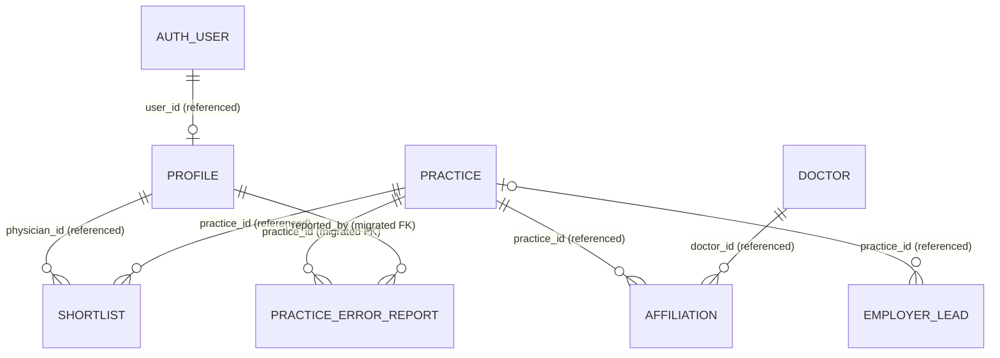

# Domain model and authorization

## Accuracy boundary

This repository does **not** contain the production schema baseline. It contains DDL only for `practice_error_reports` and a follow-up grant migration. Everything else below is an observed application contract reconstructed from Supabase queries and TypeScript shapes, not authoritative DDL.

- **Code-derived fact — migrated**: guaranteed by tracked SQL.
- **Code-derived fact — referenced**: a field/relation is consumed by current code, but type, nullability, constraint, and policy may differ in production.
- **Owner confirmation required**: cannot be established here.

Do not use this document to recreate production tables or RLS. Obtain a schema export first.

## Conceptual model

`AUTH_USER` denotes Supabase Auth and is not declared in repository migrations. Cardinalities outside the two migrated foreign keys are inferred from query patterns.

## Entity inventory

### Supabase Auth user

**Code-derived fact — referenced**

Auth supplies a user UUID, email, identities/providers, and sessions. Application profile queries match `profiles.user_id` to this UUID. The signup flow is email/password or Google.

**Owner confirmation required:** identity schema, provider linkage rules, duplicate-email behavior, Auth retention/deletion, and whether one auth user must have exactly one profile.

### `profiles`

**Code-derived fact — referenced**

Observed identifiers and state:

- `id`: profile identifier used by shortlists and reports;
- `user_id`: Supabase Auth user identifier;
- `email`;
- `first_name`, `last_name`, `phone`;
- `npi`, `npi_verified`;
- `training_status`, `subspecialty`;
- `preferred_state`, `start_year`, `clinical_focus`;
- `practice_setting_preference`, `current_practice`;
- `procedures_performed`, `procedures_desired`;
- `terms_accepted`, `data_sharing`;
- `onboarding_complete`, `signup_date`;
- `is_admin`;
- `deleted_at`.

Some fields are treated as arrays by the UI. Onboarding upserts by `user_id`, with an update-by-email fallback. Account edits update by `user_id`. Admin screens list selected profile fields and can set `npi_verified` and `deleted_at`.

No tracked constraint proves uniqueness of `user_id`, email, or NPI; no type definition proves the fields' database types; and no policy proves users can only read/update their own profile.

### `practices`

**Code-derived fact — referenced**

Observed identity/location/contact fields include:

- `id`, `practice_name`, `org_pac_id`;
- `city`, `state`, `city_st`, `latitude`, `longitude`;
- `phone`, `website`.

Observed intelligence fields include:

- `retention_score`, `retention_score_delta`;
- `experience_level`, `experience_level_delta`;
- `latest_roster_size`, `total_physicians_all_time`;
- `short_tenure_departure_count`, `med_yrs_grad`, `veteran_count`;
- tenure buckets `tenure_0_1`, `tenure_2_3`, `tenure_4_5`, `tenure_6_7`, `tenure_8_plus`.

List and detail clients can read practices directly. Admin lead-linking searches practice name/city/state. The cache stores a subset in browser IndexedDB for one hour of reuse, with stale records retained beyond TTL until overwritten.

### `doctors`

**Code-derived fact — referenced**

Observed fields are `id`, `physician_name`, `npi`, `graduation_year`, and `last_known_affiliation`. List and detail screens query this resource directly.

The relationship between a doctor and an authenticated profile is not represented. A `doctor` appears to be workforce data, while `profile` appears to be an application account; do not assume they are the same person/entity or automatically link them by NPI.

### `affiliations`

**Code-derived fact — referenced**

Observed fields are `id`, `doctor_id`, `practice_id`, `npi`, `status`, `first_seen_year_at_org`, `last_seen_year_at_org`, `tenure_years`, `grad_yr`, and `city_st`. Queries embed related practice or doctor records. Affiliations support physician career histories and practice rosters.

The code does not define status values, uniqueness, handling of overlapping affiliations, date precision, or derivation rules.

### `shortlists`

**Code-derived fact — referenced**

Observed fields are `id`, `physician_id`, and `practice_id`. Despite the name `physician_id`, the UI inserts the current `profiles.id`, then joins `practices`. Users add and delete favorites directly from the browser.

The repository cannot prove:

- `physician_id` references `profiles.id`;
- one row per profile/practice pair;
- ownership RLS;
- cascade behavior after profile/practice deletion.

The terminology “favorites” and “shortlist” is mixed in UI/code.

### `employer_leads`

**Code-derived fact — referenced**

Observed fields:

- `id`, `practice_name`, optional `practice_id`;
- `point_of_contact`, `email`, `phone`;
- `primary_location`, `practice_setting`;
- `clinical_surgical_mix`, `ideal_hiring_timeline`;
- `subspecialties_interest`, `additional_details`;
- `source`, `received_at`.

The jobs page reads all fields and displays contact data to users admitted by the proxy. Admins may link a lead to a practice. There is no tracked schema, expiry, publication status, source validation, or RLS evidence.

### `practice_error_reports`

**Code-derived fact — migrated**

Tracked DDL:

- `id uuid` primary key, default `gen_random_uuid()`;
- `practice_id uuid NOT NULL`, FK to `practices(id)`, `ON DELETE CASCADE`;
- `reported_by uuid NOT NULL`, FK to `profiles(id)` with no explicit delete action;
- `field_flagged text NOT NULL`, restricted to `practice_name`, `address`, `phone`, `website`, `other`;
- `description text NOT NULL`, length 1–1,000;
- nullable `snapshot jsonb`;
- `status text NOT NULL DEFAULT 'new'`, restricted to `new`, `reviewing`, `fixed`, `rejected`;
- nullable `admin_notes text`, nullable `resolved_at timestamptz`;
- `created_at timestamptz NOT NULL DEFAULT now()`.

Indexes cover `(status, created_at DESC)` and `practice_id`.

The client snapshot currently contains practice name, `city_st`, phone, and website. An admin can compare snapshot to current values and update status, notes, and resolved timestamp. Database DDL does not constrain snapshot shape or require resolution fields to match status.

## Authorization evidence

### Proven RLS: `practice_error_reports`

RLS is enabled. The authenticated role has INSERT, SELECT, and UPDATE grants.

| Operation | Proven policy |
|---|---|
| INSERT | Allowed when a profile exists whose `id = reported_by` and `user_id = auth.uid()` |
| SELECT | Allowed when the current auth user has a profile with `is_admin IS TRUE` |
| UPDATE | Allowed under the same admin predicate in both `USING` and `WITH CHECK` |
| DELETE | No tracked policy or grant |

Ordinary reporters cannot select their reports under the tracked policies. The insert policy does not restrict which practice is reported or the JSON snapshot beyond table constraints.

### Unproven authorization

For `profiles`, `practices`, `doctors`, `affiliations`, `shortlists`, and `employer_leads`, the repository contains client queries but no policies. The following are application intentions suggested by predicates, not verified controls:

- a user reads/updates the profile matching their Auth user;
- a user manipulates shortlist rows associated with their profile;
- authenticated users read workforce/practice/job data;
- admins read and mutate additional profile and lead fields.

Client filters and admin UI checks can be bypassed by a modified browser request. Production RLS/grants must enforce these rules.

## Data ownership and classification draft

The following classification is conservative and requires owner/legal approval:

- Account/contact data (`email`, name, phone): personal information.
- Professional profile/preference data (NPI, training, career interests, procedures, desired states): personal/professional information and potentially sensitive in aggregation.
- `data_sharing` and `terms_accepted`: consent/acceptance indicators, but current fields lack observed version, timestamp, text version, source, or withdrawal audit.
- Admin status and verification state: security-sensitive authorization/operational data.
- Employer contact details: personal or business contact information depending on source/context.
- Correction descriptions, snapshots, reporter identity, and admin notes: may contain personal information or free-text sensitive content.
- Practice/doctor/affiliation data: described publicly as derived from public sources, but exact provenance and re-identification/privacy treatment require confirmation.

No health records or patient data are intentionally represented by observed fields. That is not proof that free-text fields cannot receive such data.

## Deletion and referential behavior

Only one cascade is proven: deleting a practice cascades its error reports. The `reported_by` FK has default Postgres behavior (normally preventing profile deletion while referenced unless altered elsewhere). However, the application performs soft deletion of profiles by timestamp, not row deletion.

Unknowns include:

- Auth-user deletion and profile lifecycle;
- shortlist/profile/practice cascades;
- doctor/affiliation cascades;
- employer-lead retention;
- report retention and reporter pseudonymization;
- legal holds and backups.

## Current known limitations

- Most production DDL and all but one table's RLS are absent.
- TypeScript interfaces are duplicated across pages and are not generated from schema.
- Multiple pages use `select('*')`, increasing accidental data exposure risk as schemas evolve.
- Consent is stored as current Booleans without repository-visible evidence/version history.
- Onboarding can report success after a failed upsert and unverified fallback update.
- `shortlists.physician_id` naming conflicts with its apparent use as a profile ID.
- Free-text lead details, report descriptions, snapshots, and admin notes lack documented classification and sanitization rules.
- No database-level audit history is represented for admin changes, report status, verification, consent, or deletion.

## Owner confirmation required

Supply and review:

1. authoritative schema export including types, defaults, constraints, indexes, views, functions, triggers, grants, and all RLS policies;
2. an identity map for Auth users, profiles, and workforce doctors;
3. field definitions and data stewards;
4. complete actor/action/row authorization matrix;
5. PII classification and approved handling for each field;
6. consent evidence model and withdrawal history;
7. deletion/cascade/anonymization behavior, backup implications, and legal holds;
8. employer-lead publication and contact-access rules;
9. audit requirements and immutable history;
10. canonical “favorites” versus “shortlist” terminology.
