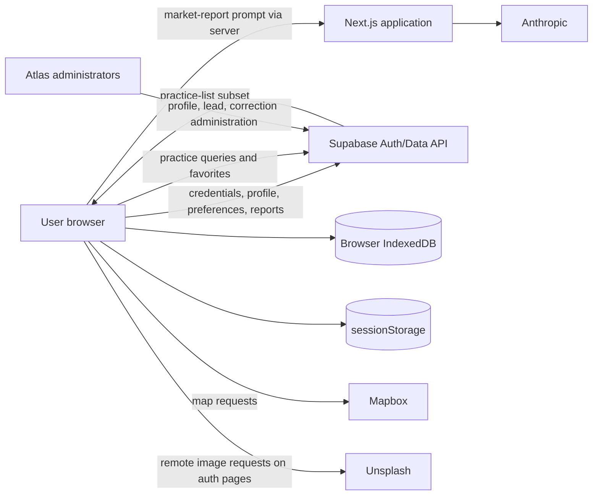

# Privacy, retention, and processor map

## Purpose and legal status

This is an engineering data map based on repository behavior as inspected on 2026-07-19. It is not legal advice, a data-processing agreement, or proof of production configuration.

- **Code-derived fact** means collection, display, storage, or transmission is visible in code.
- **Published policy claim** means the public Privacy Policy or Terms says it; implementation and legal approval are not established here.
- **Owner confirmation required** means legal, contractual, production, or operational evidence is missing.

The public Terms and Privacy pages remain the canonical published legal text. This document identifies reconciliation work; it does not replace those pages.

## Data-flow overview

## Collection and use inventory

### Authentication/account data

**Code-derived facts**

- Supabase Auth receives email/password signup and login data or Google OAuth identity data.
- Browser/server clients maintain sessions in Supabase-managed cookies/storage behavior.
- Application code reads user ID, email, and identity provider.

Password values are sent to Supabase through its SDK and are not written to Atlas database tables by observed code. Provider scopes, auth logs, token retention, and Supabase configuration are external.

### Profile and career-preference data

Onboarding/account screens collect or process:

- first and last name, email, phone, NPI;
- preferred states, anticipated start year;
- clinical focus, training status, current program/practice;
- practice-setting preferences;
- procedures performed and desired;
- Terms acceptance and `data_sharing`;
- signup/completion state.

Admin UI additionally processes verification, admin, and soft-deletion state. Production table DDL and full access policy are absent.

### Practice/workforce intelligence

Clients read practice names, locations, coordinates, contact details, identifiers, roster/tenure metrics, scores, doctor names/NPIs/graduation years, and affiliation histories. Public copy says these derive from CMS public data, but the exact source lineage is not reproducible here.

### Favorites

The application stores profile-to-practice shortlist relationships in Supabase. A user’s favorites are cached in memory for up to 30 minutes in the current page runtime. The repository has no shortlist DDL, retention, or deletion policy.

### Employer leads and contacts

The jobs page displays practice listing details and point-of-contact name, email, and phone to authenticated users. Admins may link leads to practices. The source, notice/consent, publication basis, moderation, expiry, and access policy are unknown.

### Practice correction reports

Supabase stores reporter profile ID, practice ID, flagged field, free-text description, JSON snapshot, status, admin notes, resolution time, and creation time. Snapshots contain practice name, location, phone, and website. Free-text fields could receive unanticipated personal or sensitive data.

Tracked RLS allows authenticated users to submit against their own profile; only admins can select/update. No DELETE policy exists in tracked migration.

### Market report builder and AI payloads

An admin can paste regional-practice and pipeline-candidate Markdown tables and enter client name, contact, market, specialty, radius, and pipeline information. Parsed rows, computed medians, and those metadata are placed into a prompt and sent through the Next.js server to Anthropic.

The tool does not identify the source of pasted rows, prevent personal/confidential content, redact candidate names, capture authorization, or persist review metadata. The API route itself is callable by any authenticated account under current code because it lacks an admin check.

### Browser/device storage

- IndexedDB stores a practice-list subset: names, location/state, scores/delta, roster size, coordinates, phone, and organization ID. TTL for reuse is one hour; expiration does not delete the entry.
- In-memory practice and favorites caches last for the page/process lifetime and configured TTL.
- `sessionStorage` stores map center, zoom, and last-view marker.
- Supabase auth uses browser/cookie mechanisms through `@supabase/ssr`; exact keys and retention are library/configuration dependent.

Logout and soft deletion do not explicitly clear IndexedDB or map session storage.

## Processor/service map

| Service/party | Code-observed role | Data visibly transmitted or stored | Unknowns requiring owner evidence |
|---|---|---|---|
| Supabase | Authentication, session handling, Postgres data API | Credentials/OAuth identity, account/profile/preferences, favorites, product data, leads, corrections | Legal entity/region, DPA, subprocessors, retention, backups, logs, security settings, deletion |
| Hosting provider for Next.js | Serves pages, runs proxy and AI route | Request metadata, cookies/session traffic, AI prompts in transit | Provider, region, logs, retention, access, DPA, subprocessors |
| Anthropic | Generates market-report content | Full prompt including client/contact/market fields, pasted practice and pipeline rows, computed medians | Approved model/account, DPA, training/retention settings, region, zero-retention status, deletion, allowed data |
| Mapbox | Browser map rendering | Token, map viewport/requests, IP/device/network metadata; practice coordinates are rendered client-side | Account settings, telemetry, DPA, retention, token restrictions, privacy mode |
| Google | OAuth identity provider | OAuth identity/authentication metadata | Scopes, controller/processor role, retention, contracts, account configuration |
| Unsplash | Remote auth-page images | Browser request metadata such as IP/user agent/referrer as governed by browser behavior | Approved use, privacy terms, whether images should be self-hosted |
| CMS | Published source named in UI | Source workforce/practice data is claimed to originate here | Exact datasets/releases/license and whether direct or via another system |
| Practices/industry partners | Potential recipients under `data_sharing` copy | User profile/contact/career-interest data, scope unknown | Recipient list, contracts, purpose limits, disclosure method, retention, withdrawal propagation |
| Atlas administrators | Internal access via admin UI | Profiles, NPI verification state, leads/contact data, report/reporter data, admin notes | Eligibility, least privilege, training, audit, offboarding, export controls |

This table does not prove legal “processor” status. Counsel must classify each party and approve terminology.

## Consent and acceptance evidence

Onboarding requires a `terms_accepted` Boolean before submission and separately offers an optional `data_sharing` Boolean. Account settings allow toggling `data_sharing`. Copy says the user agrees to be contactable by ophthalmology practices and industry partners and can opt out.

Current repository evidence does not include:

- accepted text/policy version;
- timestamp for acceptance or withdrawal;
- collection surface, locale, or IP/user agent;
- separate practice versus industry-partner choices;
- recipient/category disclosures;
- purpose-specific consent;
- immutable consent history;
- downstream withdrawal propagation.

Signup also states agreement by signing up, while onboarding collects a checkbox. The authoritative acceptance event requires legal/product confirmation.

## Retention and deletion

### Implemented lifecycle

Account deletion sets `profiles.deleted_at` to the current timestamp, signs out, and causes future protected requests to sign out through the proxy. This is soft deletion only.

No repository code hard-deletes the Auth user, profile, shortlist, corrections, or other linked data; anonymizes records; contacts processors; honors legal holds; or verifies completion. No scheduled deletion job exists.

### Published claims requiring reconciliation

- Account UI: profile can be restored if the user contacts Atlas within 30 days.
- Privacy Policy: verified deletion requests are actioned within 45 days, except legal retention.
- Privacy Policy: data is retained while the account is active or as needed for the service; transaction data may be retained for accounting/tax.

These could describe a 30-day restoration window followed by completion by day 45, but the repository does not say that and it must not be inferred. There is also no visible payment/transaction implementation.

### Retention schedule

No approved schedule is evidenced. Owners must define active and post-deletion periods for:

- Supabase Auth identities, sessions, and auth logs;
- profiles and consent history;
- shortlists;
- employer leads/contact details;
- correction reports, snapshots, reporter identity, and admin notes;
- workforce/source data and raw ingestion releases;
- browser caches;
- hosting/application/database logs;
- backups and restore copies;
- AI prompts/responses and market-report drafts;
- support/DSAR records and legal holds.

## Rights-request and deletion procedure

The Privacy Policy directs users to a published support email for access, correction, deletion, and consent withdrawal. No internal DSAR workflow, identity-verification implementation, export tool, suppression list, request ledger, or processor-notification process exists in this repository.

**Owner confirmation required:** request intake, identity verification, jurisdiction handling, response deadlines/extensions, search systems, export format, exemptions, approval, completion evidence, appeal, and processor communication.

## Public-policy implementation gaps

The Privacy Policy mentions profile CV/areas of expertise, payment data, cookies/beacons/tags, promotional email, SMS/MMS, transaction data, tracking opt-out, and payment/subscription activity. Current repository code does not show:

- CV upload/storage;
- payments or subscription billing;
- SMS integration or SMS consent collection;
- analytics/advertising SDKs, pixels, or cookie banner;
- marketing email platform;
- sale/share opt-out implementation.

Absence from this repository does not prove absence in the deployed organization. Legal/product owners must either identify the external implementation and processors or narrow published claims.

## Security and minimization observations

- Browser code often uses `select('*')`, which can expose newly added columns unintentionally.
- The AI endpoint accepts arbitrary prompt text without local admin authorization, body-size limits, redaction, or rate limiting.
- Employer contact details are broadly displayed after authentication.
- Free-text corrections/admin notes and pasted pipeline tables can contain unnecessary personal data.
- IndexedDB data persists after TTL and logout.
- The complete RLS inventory is unavailable.
- No audit log is visible for profile access, consent changes, lead access, AI use, or administrator changes.

These are current known limitations, not proof of a reportable privacy violation.

## Owner confirmation required

Legal, privacy, security, and data owners must provide:

1. controller/processor roles, legal bases, jurisdictions, and privacy notices;
2. complete vendor/subprocessor inventory, contracts/DPAs, regions, retention, and transfer mechanisms;
3. data classification and minimization decisions by field;
4. approved consent/acceptance record and withdrawal propagation;
5. retention schedule, backup treatment, legal holds, and deletion evidence;
6. reconciliation of 30-day restoration and 45-day deletion language;
7. DSAR workflow and accountable contact;
8. whether CV, payments, SMS, marketing, cookies/tracking, and sale/share provisions apply;
9. employer-contact publication basis and lead expiry;
10. approved data boundary for Anthropic and market reports;
11. browser cache clearing policy;
12. legal review and effective-date approval for this map and public copy.
