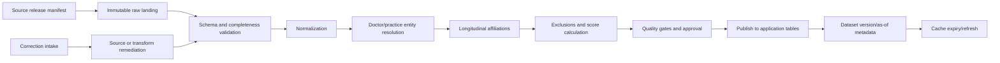
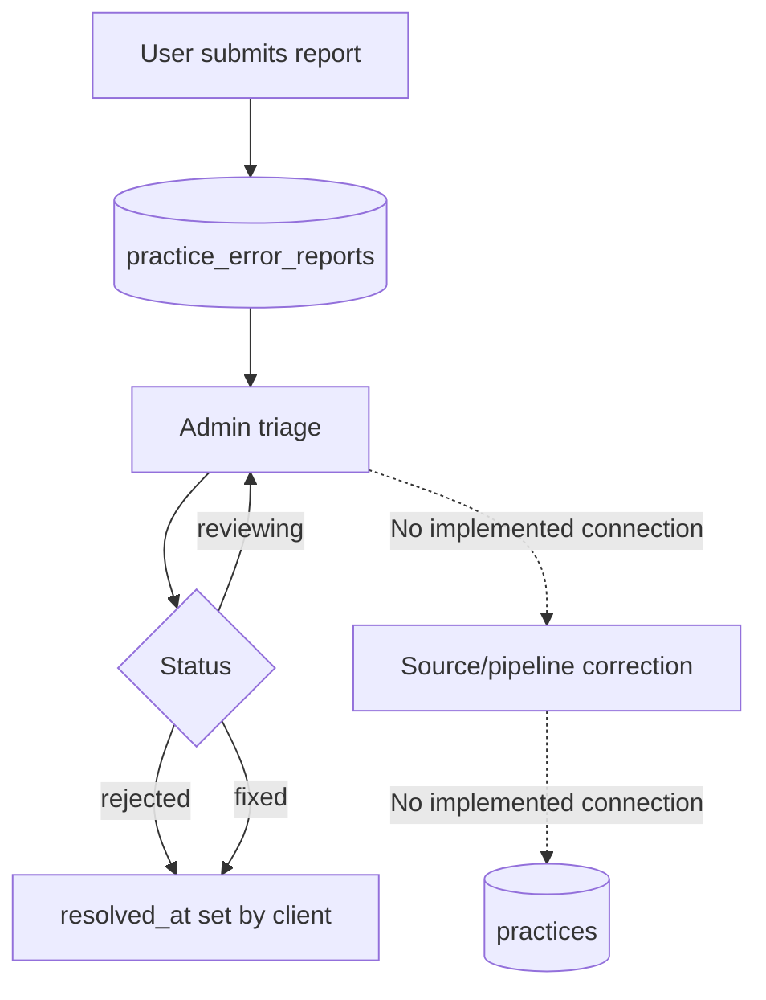

# Provenance, ingestion, and refresh

## Evidence boundary

The repository contains consumers of processed Atlas data, public provenance claims, and a correction workflow. It contains no source download manifest, ingestion code, scheduler, transformation SQL, entity-resolution implementation, scoring job, validation report, or publication procedure.

Accordingly:

- **Code-derived fact** describes displayed claims, consumed fields, or repository behavior.
- **Owner confirmation required** identifies facts that must come from pipeline owners and dated source artifacts.
- Public copy is evidence of what Atlas currently tells users; it is not evidence that the underlying pipeline implements the claim.

## Published claims versus verified implementation

The scoring methodology and Terms pages state that:

- practice intelligence is derived from publicly available CMS Medicare Part B Provider Data;
- annual physician-practice affiliation snapshots are used from 2019 onward;
- no surveys, self-reporting, recruiter claims, proprietary data, or third-party data contribute;
- scores are historical and observational;
- practices cannot influence source data;
- corrected errors are reflected in a next update cycle.

These are **code-derived published claims**, not repository-verifiable pipeline facts. Exact CMS dataset names, file/release IDs, covered years, licenses, download timestamps, checksums, and transformations are absent. “No third-party data” also needs clarification because entity resolution or enrichment could use reference data even if scoring inputs do not.

## Observed published data products

### Practices

The application consumes identity, location, contact, coordinates, scores/deltas, roster size, physician totals, departure counts, graduation/experience summaries, veteran count, and tenure buckets. See `docs/data/domain-model-and-authorization.md` for the observed field list.

### Doctors and affiliations

The application consumes doctor identity/name/NPI, graduation year, latest affiliation, and longitudinal affiliations with practice, first/last observed year, status, tenure, location, and related NPI.

### Employer leads

The jobs product consumes a separate `employer_leads` dataset containing listing/contact details, source, receipt date, and optional practice linkage. Nothing in the repository establishes this as CMS-derived. It must be documented as an independent provenance domain.

### Profile and correction data

User-entered profile/preferences, consent indicators, and correction reports originate in Atlas UI flows, not CMS. Report snapshots capture selected practice values at submission time. Admin triage changes report status/notes but does not edit the underlying practice row in the inbox.

### Market report input

The admin report builder accepts pasted Markdown tables for regional practices and pipeline candidates. It parses those tables in the browser and sends the parsed rows, client/contact/market metadata, and computed medians to Anthropic in a prompt. The source of pasted data is not recorded or validated by the tool.

## Required lifecycle (not currently evidenced)

The following diagram is a documentation target, not a claim that these stages exist:

Every stage requires an accountable owner, input/output contract, version identifier, validation evidence, failure behavior, and rerun/backfill procedure.

## Inferred transformation questions

The application model implies transformations that are not present:

1. Map raw organizations to stable `practices.id` and `org_pac_id`.
2. Map individuals to stable `doctors.id` and NPI.
3. derive yearly/longitudinal affiliations and active/departed status;
4. derive tenure and roster summaries;
5. identify or exclude training/fellowship roles;
6. infer retirement/down-weighting conditions;
7. calculate attrition resistance, tenure strength, cluster modifiers, retention score, experience level, and 2019 deltas;
8. geocode practice locations;
9. publish a job lead's optional relationship to a practice.

Do not infer algorithms from field names or marketing copy.

## Scoring outputs and public methodology

The UI displays:

- retention score and change versus 2019;
- experience level and change versus 2019;
- roster size and all-time physician count;
- short-tenure departure count;
- graduation-year/experience summary, veteran count, and tenure buckets.

The methodology page describes a 0–100 retention composite built from “Attrition Resistance” and “Tenure Strength,” modified by temporal and tenure-similarity clusters. It qualitatively describes tenure weights, training exclusions, retirement down-weighting, and low influence from single departures. It says Experience Level is contextual and not in the composite.

Exact weights, thresholds, windows, sample minimums, normalization, missing-data behavior, baseline cohort, and validation are absent. A score or delta value in the database proves only that a value is consumed, not how it was produced.

## Refresh and browser visibility

There is no repository evidence of source or database refresh cadence.

After database publication, practice-list clients can continue using IndexedDB data for up to a one-hour TTL. Expired IndexedDB entries are ignored but not actively deleted. Loading a practice detail patches that practice in the list cache and the in-memory favorites cache if present. Favorites otherwise use an in-memory 30-minute TTL. No global dataset-version check invalidates caches.

The UI does not display a per-record or global data “as of” timestamp. Fixed copy uses varying statements such as “from 2019 onwards,” “eight years,” and “updated periodically,” while home/onboarding counts differ. These claims need a canonical dated manifest.

## Correction lifecycle

**Code-derived facts**

1. An authenticated user opens a practice detail and submits a report.
2. The report identifies a field, includes free-text description, and snapshots practice name/location/phone/website.
3. RLS ensures the reporter profile belongs to the current Auth user.
4. An admin can view the report, compare snapshot and current values, add notes, and mark `new`, `reviewing`, `fixed`, or `rejected`.
5. Marking fixed/rejected in the client sets `resolved_at`.

The inbox does not modify `practices`, start an ingestion job, notify the reporter, retain source evidence, or prove publication. `fixed` is therefore an operator-entered status, not a technically enforced data state.

## Minimum manifest required for each release

This is a required governance proposal, not current behavior:

- Atlas dataset version and publication timestamp;
- exact source dataset/release URLs or IDs;
- covered service years/snapshots;
- source download timestamps and checksums;
- pipeline code/version and configuration version;
- row counts at each stage;
- accepted/rejected rows and reasons;
- duplicate/entity-merge statistics;
- scoring methodology version;
- quality checks, thresholds, outcomes, and approver;
- backfills/corrections included;
- known gaps and next expected refresh.

## Quality gates requiring definition

**Owner confirmation required**

- source schema drift and required-column validation;
- row-count and year-completeness thresholds;
- NPI and organization identifier validation;
- duplicate, split, and merge detection;
- geocoding accuracy and fallback;
- impossible/overlapping tenure checks;
- score bounds, null behavior, minimum sample size, and regression tolerances;
- outlier review and comparison to prior release;
- correction regression tests;
- referential integrity and RLS validation before publication;
- rollback criteria.

## Failure, retry, and backfill

No implementation establishes whether jobs are idempotent, transactional, restartable, or observable. Owners must document:

- orchestration platform and code repository;
- schedule and triggering;
- checkpoints and idempotency keys;
- partial-failure isolation;
- alert destinations and acknowledgement SLA;
- retry limits and dead-letter handling;
- backfill ordering and score recomputation;
- publish transaction/blue-green strategy;
- rollback to a prior dataset version;
- cache invalidation after emergency correction.

## Current known limitations

- No reproducible ingestion or scoring implementation is present.
- Public claims cannot be tied to a dated source manifest.
- Most production schema/RLS is absent.
- The correction inbox is disconnected from source remediation and publication.
- The UI exposes no dataset version/as-of date.
- Browser caching can delay visibility after publication.
- Employer-lead and market-report-input provenance is not recorded by application code.
- AI report prompts can include pasted candidate/client data without source or approval metadata.
- There is no visible quality report, audit trail, lineage catalog, or pipeline monitoring.

## Owner confirmation required

Pipeline/data owners must provide:

1. exact source inventory, releases, licenses, and covered dates;
2. pipeline location, runtime, owners, and credentials boundary;
3. raw-data retention and immutability approach;
4. entity matching/deduplication logic and manual overrides;
5. all exclusions and scoring formulas/versioning;
6. cadence, publication process, quality gates, and rollback;
7. failure/retry/backfill and monitoring procedures;
8. correction evidence, propagation, reporter communication, and definition of `fixed`;
9. employer-lead source, moderation, expiry, and refresh;
10. approved source/handling of market-report tables;
11. canonical dataset manifest and UI as-of metadata.
